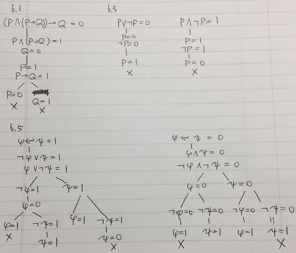
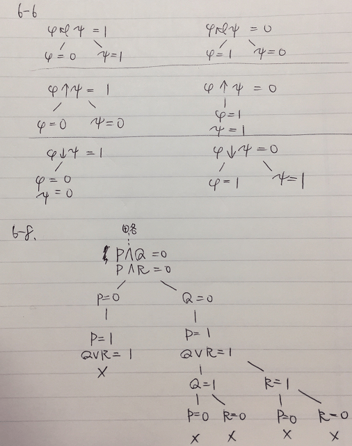
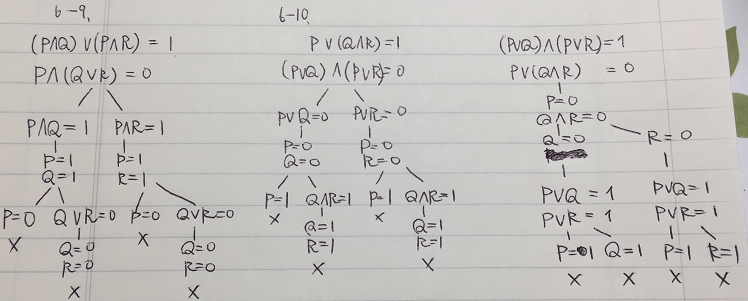
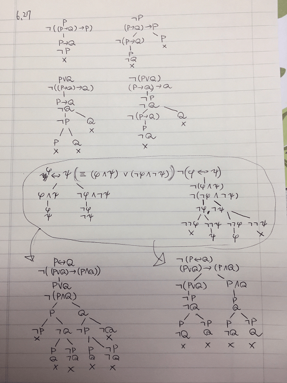
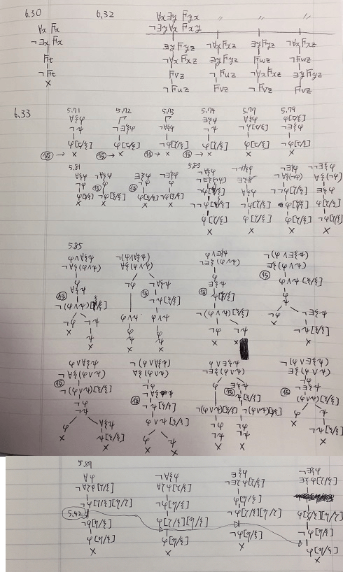

# 6.1, 6.3, 6.5: タブロー


# 6.6, 6.8: タブロー


# 6.9, 6.10: タブロー


# 6.15

φ[ζ/ξ] ⊨ ∀ξφ の反例として ζ∈fvφ の場合の適当な例を考える。

φ: x=y とする。その時、 ∀xφ ≡ ∀x x=y だし、φ[y/x] ≡ y = z (ただし z∉{x,y}なる変数)である。y ↦ 0, z ↦ 0 なる割り当てにおいて、φ[y/x] は充足するが、∀x x=y は充足しない。よって「φ[ζ/ξ] ⊨ ∀ξφ」は成立しない。

# 6.22
示す式
```
〖∃ξφ〗@M,g = 1 ⇒ 〖φ[ζ/ξ]〗@M,g' = 1 なる gのζ変異 g' が存在
```
証明:
```
〖∃ξφ〗@M,g = 1
⇔〖∃ζφ[ζ/ξ]〗@M,g = 1 (ただし ζ は ζ∉fvφ. α同値性より)
⇔ ある a∈DM が存在し〖φ[ζ/ξ]〗@M,g[ζ↦a] = 1
```

# 6.28



# 6.30, 6.32, 6.33

